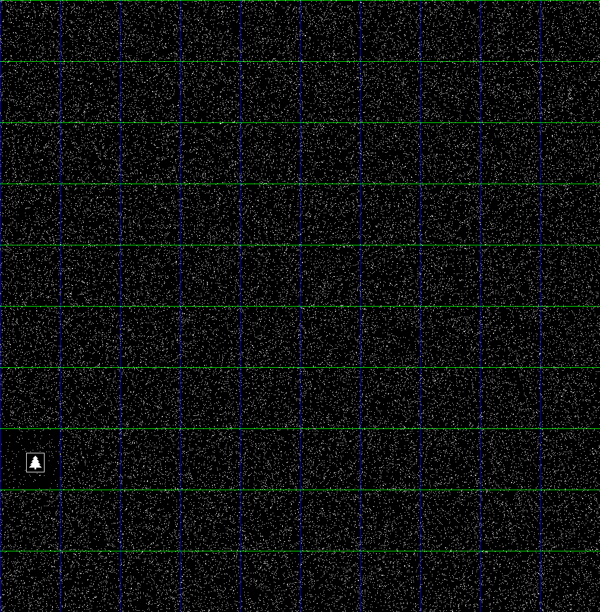

# Part 1

Piece of cake.

# Part 2 Attempt #1 - Image Files

This required an ugly, but pragmatic approach.  It would have been really
nice to employ an image detection algorithm of some kind, but that's beyond
my area of expertise and I didn't have sufficient motivation to spend several
hours (or days) learning enough about it to make it work.  It didn't help that
I didn't know what kind of christmas tree I was looking for, how big it was,
and so on.

I also considered using an [automatic clustering algorithm](https://en.wikipedia.org/wiki/Automatic_clustering_algorithms)
to see if I could detect "interesting" frames that might have a solution.
But I decided first to bodge something first instead.  That gave me the
solution pretty quickly.  Although I'm not particularly proud of the fact
that it required me to manually eyeball nearly a hundred files, it was
relatively quick and painless.  Sometimes the best solution is the one that
gets the job done quickly so you can move onto other things.  Given that this
is a one-off and not something I need to do every day, there's little to be
gained from coding up an elegant but complex solution that full automates the
process.

I first ran [part2.js](part2.js) with the `CREATE_TILES` flag set true.
This generated 100 files in the [images](images) directory, each of which
contained 100 images in a 10x10 grid, showing an iteration of the robots.

e.g.

```
01000-01099.png
01100-01199.png
01200-01299.png
...etc...
```

I then visually inspected these and discovered that the
[08200-08299.png](images/08200-08299.png) file contained contained the
christmas tree in frame 8270.



Then I set `CREATE_TILES` to false, set `INSPECT_STEP` to 8270 and ran
[part2.js](part2.js) again.  This generated the
[solution-8270.png](images/solution-8270.png) file in the [images](images)
directory which allowed me to check that it was correct.


# Part 2 Attempt #2 - Standard Deviation

A few hours after the first attempt I decided to have another crack at this
and try to solve it "properly".

This is implemented in `part2-sd.js`.  It computes the standard deviation
of the robot population at each step and makes the assumption that the step
with the lowest SD is the one with a well-defined pattern.

Lo and behold, it produces the same result.